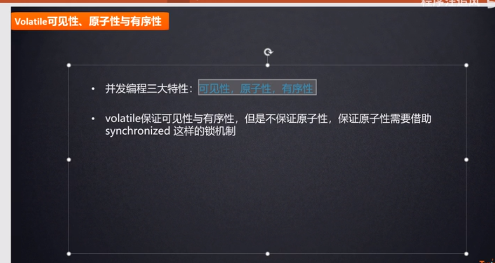

# cpu结构

    cpu的访问速度: 访问寄存器 > 缓存 > 主存.

- 当一个CPU需要`读取主存时`，它会将主存的数据读到cpu高速缓存中。再将高速缓存中的数据读到cpu内部的寄存器中，然后再执行操作.
- 当CPU需要将结果写回到主存中去时，它先会将内部寄存器的值刷新到高速缓存中，然后在某个时间点将值刷新回主存.

# 总线

总线: cpu中的数据和主内存中的数据怎么做交互呢?它们2个独立的硬件之间是怎么做交互呢?实际上2个硬件之间的交互就是通过物理的总线来交互的,就比如你打电话还需要电话线呢,cpu和物理内存之间也是有物理的线来做数据传输的.

# Java内存模型(jmm)和cpu结构之间的联系

    多个线程操作同一个共享变量,不能直接操作主内存中的共享变量,而是要把共享变量拷贝到线程自己
    的工作内存中,修改完之后,再写回到主内存中.

# volatile和并发编程的3大特性之间的关系

