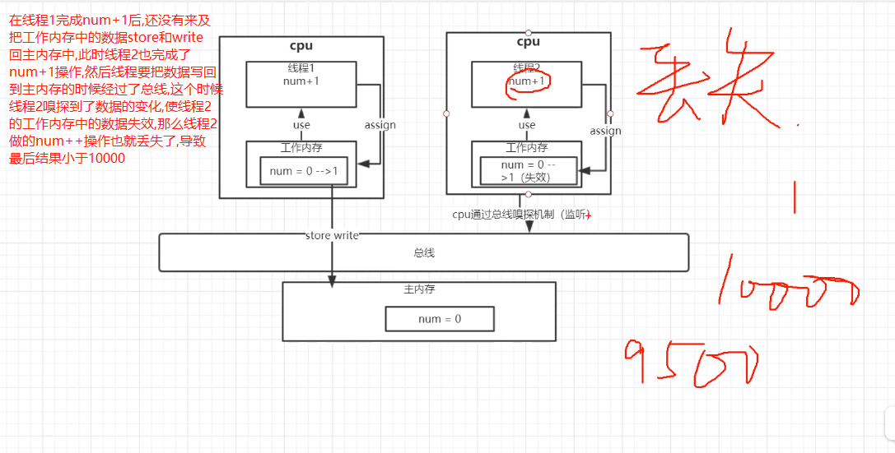

## 原子性(Atomicity)

    多个操作构成的一个整体 要么全部执行成功,要么就都不执行

在Java中，`对基本数据类型的变量的读取`和`赋值`操作是原子性操作，即这些操作是不可被中断的，要么执行，要么不执行。

```java
x = 10; //语句1,
y = x; //语句2
x++; //语句3
x = x + 1; //语句4

// 其实只有语句1是原子性操作，其他三个语句都不是原子性操作。
```

1. 语句1是直接将数值10赋值给x，也就是说线程执行这个语句的会`直接将数值10写入到工作内存中`
2. 语句2实际上包含2个操作，它先要去读取x的值，再将x的值写入工作内存，虽然读取x的值以及 将x的值写入工作内存 这2个操作都是原子性操作，但是合起来就不是原子性操作了。
3. x++和 x = x+1包括3个操作：读取x的值，进行加1操作，写入新的值。

>所以上面4个语句只有语句1的操作具备原子性。也就是说，只有简单的读取、赋值（而且必须是将数字赋值给某个变量，变量之间的相互赋值不是原子操作）才是原子操作。需要注意的是，如有一段代码中有多个原子操作，但是不同的原子操作整合在一起，这段代码可能就不是原子操作了。

>在java中，可以通过synchronized或者Lock，来保证语句执行的原子性。
如果是基础类的自增操作可以使用 `AtomicInteger` 这样的原子类来实现(其本质是利用了 `CPU` 级别的 的 `CAS` 指令来完成的)。

其中用的最多的方法就是: `incrementAndGet()` 以原子的方式自增。

```java
public final long incrementAndGet() {
        for (;;) {
            long current = get();
            long next = current + 1;
            if (compareAndSet(current, next))
                return next;
        }
    }
```

首先是获得当前的值，然后自增 +1。接着则是最核心的 `compareAndSet() ` 来进行原子更新。

```java
public final boolean compareAndSet(long expect, long update) {
        return unsafe.compareAndSwapLong(this, valueOffset, expect, update);
    }
```

其逻辑就是判断当前的值是否被更新过，是否等于 `current`，如果等于就说明没有更新过然后将当前的值更新为 `next`，如果不等于则返回`false` 进入循环，直到更新成功为止。

还有其中的 `get()` 方法也很关键，返回的是当前的值，当前值用了 `volatile` 关键词修饰，保证了内存可见性。

```java
 private volatile int value;
```

# volatile为什么无法保证原子性


