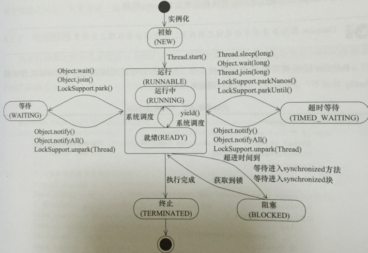

# 线程的状态




    在java.lang.Thread.State中，总共定义六种状态

1. NEW(初始):线程刚刚被创建，也就是已经new过了，但是还没有调用start()方法
2. RUNNABLE(运行):(调用Thread.start()之后，会从NEW变成RUNNABLE)这个状态只是表示，线程是可运行的。无数次提到过,一个单核CPU在同一时刻，只能运行一个线程.(RUNNABLE这个名字很具有欺骗性，很容易让人误以为处于这个状态的线程正在运行。)
3. BLOCKED(阻塞):线程处于`阻塞状态`，正在等待一个`monitor lock`。通常情况下，是因为`本线程与其他线程公用了一个锁`。其他线程正在使用这个锁进入某个synchronized同步方法块或者方法，而本线程进入这个同步代码块也需要这个锁，最终导致本线程处于阻塞状态。
4. WAITING(等待):等待状态，调用以下方法可能会导致一个线程处于等待状态：

`Object.wait() with no timeout`
`Thread.join() with no timeout`
`LockSupport.park()`

对于wait()方法，一个线程处于等待状态，通常是在等待其他线程完成某个操作。本线程调用某个对象的wait()方法，其他线程处理完成之后，调用同一个对象的notify或者notifyAll()方法。Object.wait()方法只能够在同步代码块中调用。调用了wait()方法后，会释放锁。

调用以下方法可能可以使一个线程从WAITING状态变成RUNNABLE状态

* Object.notify();
* Object.notifyAll();
* LockSupport.unpark(Thread);

5. TIMED_WAITING(超时等待):线程等待指定的时间，对于以下方法的调用，可能会导致线程处于这个状态：

* Thread.sleep(long)
* `Object.wait(long)` with timeout
* `Thread.join(long)` with timeout
* LockSupport.parkNanos()
* LockSupport.parkUntil()

调用以下方法可能可以使一个线程从TIMED_WAITING状态变成RUNNABLE状态：

* Object.notify();
* Object.notifyAll();
* LockSupport.unpark(Thread);

6. TERMINATED(终止):线程终止

>这些状态中NEW状态是开始，TERMINATED时销毁，在整个线程对象的运行过程中，这个两个状态只能出现一次。其他任何状态都可以出现多次，彼此之间可以相互转换。

	经常有人把线程的状态又称为线程的生命周期。个人认为这种叫法并不好，因为生命周期通常指的是一个对象从创建到销毁所必须要经历的过程。例如J2EE的Servlet的生命周期方法是init->service->destroy，这三个阶段是必须要经历的。而对于线程而言，完全可以NEW了之后就直接到TERMINATED了，或者只经历其中某个状态而不是所有。因此这可能也是官方只称之为线程状态(用java.lang.Thread.State类表示)的原因。不过，因为生命周期这个叫法在某种程度上又有一些说明力，笔者也不反对你也这样来称呼线程的不同状态。

	总之，需要知道的一点是，别人和你提到线程状态或者是线程生命周期，其实指的是同一个东西。

# 线程状态分析示例

>示例:org.java.core.base.concurrent.chapter2.ThreadState.java

通过jps与jtack分析：

```shell
jps
jstack pid >> 1.txt
```

>jps命令用户查看当前系统中运行的java进程。jstack工具用于追踪线程堆栈信息。

```shell
C:\Users\xu>jstack 6444
"BlockedThread-2" #16 prio=5 os_prio=0 tid=0x0000000019477000 nid=0x1a18 waiting for monitor entry [0x000000001a52f000]
   java.lang.Thread.State: BLOCKED (on object monitor)////锁竞争导致的阻塞，在等待锁           
        at org.java.core.base.concurrent.chapter2.ThreadState$Blocked.run(ThreadState.java:90)
        - waiting to lock <0x00000000d602cd90> (a java.lang.Class for org.java.core.base.concurrent.chapter2.ThreadState$Blocked)
        at java.lang.Thread.run(Thread.java:745)

"BlockedThread-1" #15 prio=5 os_prio=0 tid=0x0000000019476800 nid=0x464 waiting on condition [0x000000001a42f000]
   java.lang.Thread.State: TIMED_WAITING (sleeping)////调用sleep方法导致的TIME-WAITING
        at java.lang.Thread.sleep(Native Method)
        at java.lang.Thread.sleep(Thread.java:340)
        at java.util.concurrent.TimeUnit.sleep(TimeUnit.java:386)
        at org.java.core.base.concurrent.chapter2.ThreadState$SleepUtils.second(ThreadState.java:100)
        at org.java.core.base.concurrent.chapter2.ThreadState$Blocked.run(ThreadState.java:91)
        - locked <0x00000000d602cd90> (a java.lang.Class for org.java.core.base.concurrent.chapter2.ThreadState$Blocked)
        at java.lang.Thread.run(Thread.java:745)

"WaitingThread-2" #14 prio=5 os_prio=0 tid=0x0000000019475800 nid=0x19c in Object.wait() [0x000000001a32e000]
   java.lang.Thread.State: WAITING (on object monitor)////已经被锁住，但是还要再次获取，注意观察下面的locked部分 
        at java.lang.Object.wait(Native Method)
        - waiting on <0x00000000d6028fa8> (a java.lang.Class for org.java.core.base.concurrent.chapter2.ThreadState$Waiting)
        at java.lang.Object.wait(Object.java:502)
        at org.java.core.base.concurrent.chapter2.ThreadState$Waiting.run(ThreadState.java:66)
        - locked <0x00000000d6028fa8> (a java.lang.Class for org.java.core.base.concurrent.chapter2.ThreadState$Waiting)
        at java.lang.Thread.run(Thread.java:745)

"WaitingThread-1" #13 prio=5 os_prio=0 tid=0x0000000019473000 nid=0x2340 in Object.wait() [0x000000001a22f000]
   java.lang.Thread.State: WAITING (on object monitor)////已经被锁住，但是还要再次获取   
        at java.lang.Object.wait(Native Method)
        - waiting on <0x00000000d6028fa8> (a java.lang.Class for org.java.core.base.concurrent.chapter2.ThreadState$Waiting)
        at java.lang.Object.wait(Object.java:502)
        at org.java.core.base.concurrent.chapter2.ThreadState$Waiting.run(ThreadState.java:66)
        - locked <0x00000000d6028fa8> (a java.lang.Class for org.java.core.base.concurrent.chapter2.ThreadState$Waiting)
        at java.lang.Thread.run(Thread.java:745)

"TimeWaitingThread" #12 prio=5 os_prio=0 tid=0x0000000019471800 nid=0x6f8 waiting on condition [0x000000001a12f000]
   java.lang.Thread.State: TIMED_WAITING (sleeping)////调用sleep方法导致的TIME-WAITING
        at java.lang.Thread.sleep(Native Method)
        at java.lang.Thread.sleep(Thread.java:340)
        at java.util.concurrent.TimeUnit.sleep(TimeUnit.java:386)
        at org.java.core.base.concurrent.chapter2.ThreadState$SleepUtils.second(ThreadState.java:100)
        at org.java.core.base.concurrent.chapter2.ThreadState$TimeWaiting.run(ThreadState.java:51)
        at java.lang.Thread.run(Thread.java:745)

"RunningThread" #11 prio=5 os_prio=0 tid=0x000000001946b000 nid=0x954 runnable [0x000000001a02e000]
   java.lang.Thread.State: RUNNABLE// //正常运行   
        at org.java.core.base.concurrent.chapter2.ThreadState$Running.run(ThreadState.java:37)
        at java.lang.Thread.run(Thread.java:745)

"Service Thread" #10 daemon prio=9 os_prio=0 tid=0x00000000193fe800 nid=0x2a4c runnable [0x0000000000000000]
   java.lang.Thread.State: RUNNABLE

"C1 CompilerThread2" #9 daemon prio=9 os_prio=2 tid=0x00000000193fd800 nid=0x20c8 waiting on condition [0x0000000000000000]
   java.lang.Thread.State: RUNNABLE

"C2 CompilerThread1" #8 daemon prio=9 os_prio=2 tid=0x000000001939e800 nid=0x17d8 waiting on condition [0x0000000000000000]
   java.lang.Thread.State: RUNNABLE

"C2 CompilerThread0" #7 daemon prio=9 os_prio=2 tid=0x000000001939b800 nid=0x2d4c waiting on condition [0x0000000000000000]
   java.lang.Thread.State: RUNNABLE

"Monitor Ctrl-Break" #6 daemon prio=5 os_prio=0 tid=0x0000000019395000 nid=0x1078 runnable [0x0000000019a2e000]
   java.lang.Thread.State: RUNNABLE
        at java.net.SocketInputStream.socketRead0(Native Method)
        at java.net.SocketInputStream.socketRead(SocketInputStream.java:116)
        at java.net.SocketInputStream.read(SocketInputStream.java:170)
        at java.net.SocketInputStream.read(SocketInputStream.java:141)
        at sun.nio.cs.StreamDecoder.readBytes(StreamDecoder.java:284)
        at sun.nio.cs.StreamDecoder.implRead(StreamDecoder.java:326)
        at sun.nio.cs.StreamDecoder.read(StreamDecoder.java:178)
        - locked <0x00000000d5f8d098> (a java.io.InputStreamReader)
        at java.io.InputStreamReader.read(InputStreamReader.java:184)
        at java.io.BufferedReader.fill(BufferedReader.java:161)
        at java.io.BufferedReader.readLine(BufferedReader.java:324)
        - locked <0x00000000d5f8d098> (a java.io.InputStreamReader)
        at java.io.BufferedReader.readLine(BufferedReader.java:389)
        at com.intellij.rt.execution.application.AppMainV2$1.run(AppMainV2.java:64)

"Attach Listener" #5 daemon prio=5 os_prio=2 tid=0x0000000017ed0800 nid=0x2b28 waiting on condition [0x0000000000000000]
   java.lang.Thread.State: RUNNABLE

"Signal Dispatcher" #4 daemon prio=9 os_prio=2 tid=0x0000000019338800 nid=0x2848 runnable [0x0000000000000000]
   java.lang.Thread.State: RUNNABLE

"Finalizer" #3 daemon prio=8 os_prio=1 tid=0x000000000337e800 nid=0x79c in Object.wait() [0x000000001923f000]
   java.lang.Thread.State: WAITING (on object monitor)
        at java.lang.Object.wait(Native Method)
        - waiting on <0x00000000d5e08ee0> (a java.lang.ref.ReferenceQueue$Lock)
        at java.lang.ref.ReferenceQueue.remove(ReferenceQueue.java:143)
        - locked <0x00000000d5e08ee0> (a java.lang.ref.ReferenceQueue$Lock)
        at java.lang.ref.ReferenceQueue.remove(ReferenceQueue.java:164)
        at java.lang.ref.Finalizer$FinalizerThread.run(Finalizer.java:209)

"Reference Handler" #2 daemon prio=10 os_prio=2 tid=0x0000000003373000 nid=0xa88 in Object.wait() [0x000000001913f000]
   java.lang.Thread.State: WAITING (on object monitor)
        at java.lang.Object.wait(Native Method)
        - waiting on <0x00000000d5e06b50> (a java.lang.ref.Reference$Lock)
        at java.lang.Object.wait(Object.java:502)
        at java.lang.ref.Reference.tryHandlePending(Reference.java:191)
        - locked <0x00000000d5e06b50> (a java.lang.ref.Reference$Lock)
        at java.lang.ref.Reference$ReferenceHandler.run(Reference.java:153)

```

参考:http://www.tianshouzhi.com/api/tutorials/mutithread/107