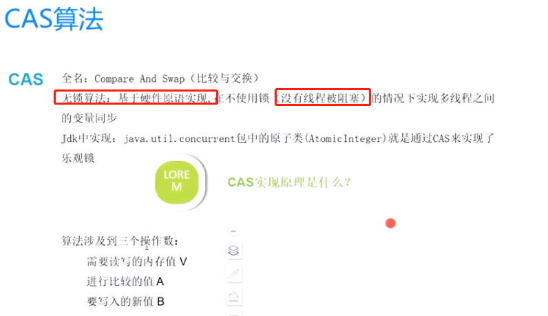
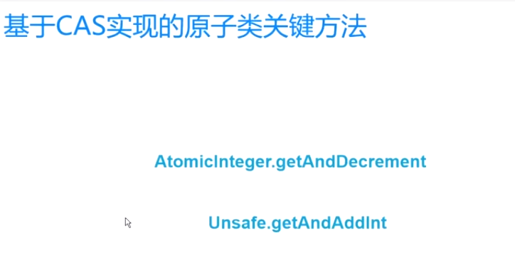
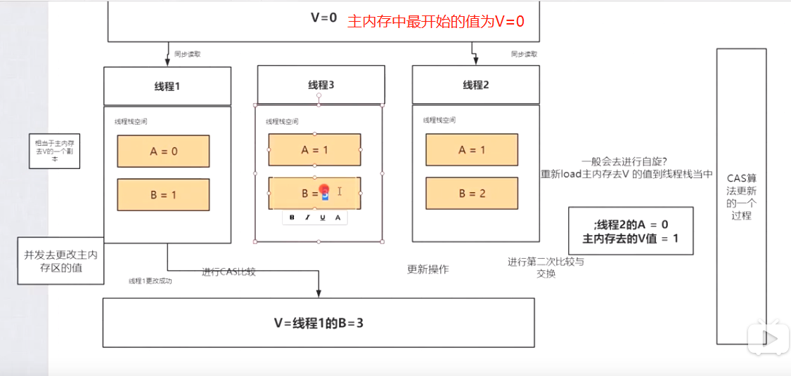
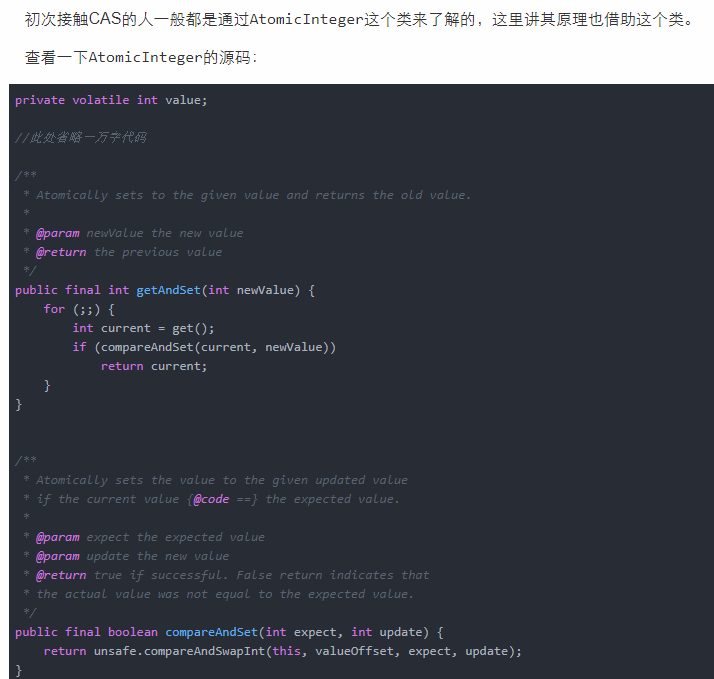
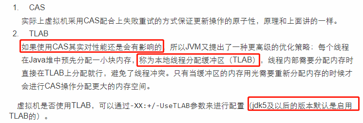
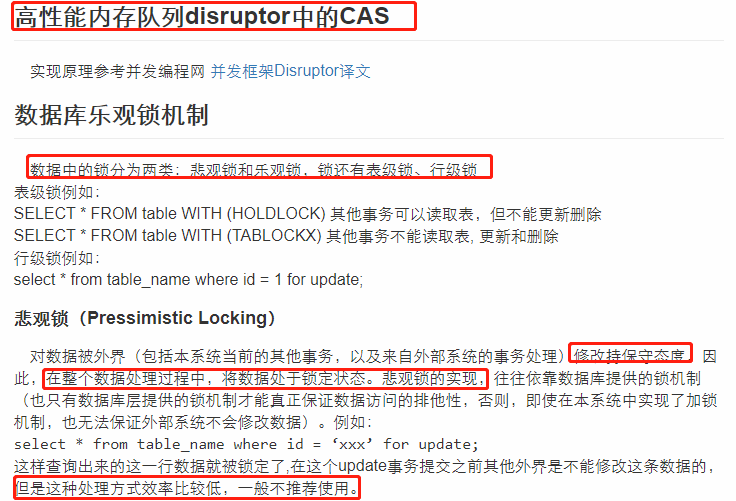
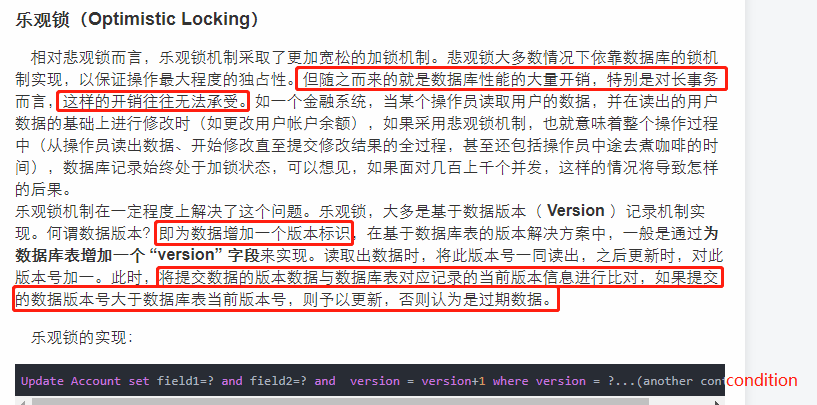
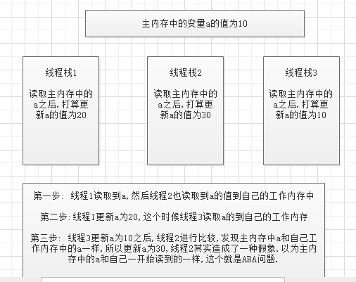

# CAS是什么
    
    比较并交换

    cas无锁算法: 多个线程并发运行,不会因为其他线程更改数据而当前线程被阻塞.线程会一直占用cpu.不会发生上下文的切换.
    
    cas是非阻塞的线程同步策略.
    
    比较和交换: 比较的是线程私有栈和主内存中的值是否相等,如果相等就进行交换,交换的是线程要更新的值和主内存中的值.

# CAS底层原理

    概括: 自旋+Unsafe类(靠的是Unsafe类的cpu指令原语来保证原子性)

    虽然JDK1.6对Synchronized做了优化，加入锁自旋特性减少系统线程切换导致的开销，
    几乎与ReentrantLock的性能不相上下，因此建议在能满足业务需求的前提下，优先使用Sychronized。

    然而互斥同步终究属于悲观的并发策略，在对性能要求极高的业务场景下使用以上互斥同步策略并不合适。接下来进而介绍如何实现乐观的同步策略(也就是CAS)

# CAS存在三大问题

    问题1: ABA问题
    问题2: 循环时间长cpu开销大,CAS操作如果长时间不成功，会导致其一直自旋，给CPU带来非常大的开销
    问题3: 只能保证一个共享变量的原子操作。对多个共享变量操作时，CAS是无法保证操作的原子性的,可以使用原子引用来解决

# 原子引用

---
    第三个问题: 可以利用AtomicReference类把多个共享变量合并成一个共享变量来操作
    
    示例: org.java.core.base.concurrent.chapter3.AtomicReferenceDemo
---

# ABA问题以及解决方案

    只要变量被某一线程修改过，改变量对应的版本号就会发生递增变化，从而解决了ABA问题

    在JDK的java.util.concurrent.atomic包中提供了AtomicStampedReference来解决ABA问题.该类的compareAndSet是该类的核心方法，实现如下：

>示例: org.java.core.base.concurrent.chapter3.AtomicStampedReferenceTest

# 好文

- [java高并发：CAS无锁原理及广泛应用](https://www.jishuwen.com/d/2BtD)