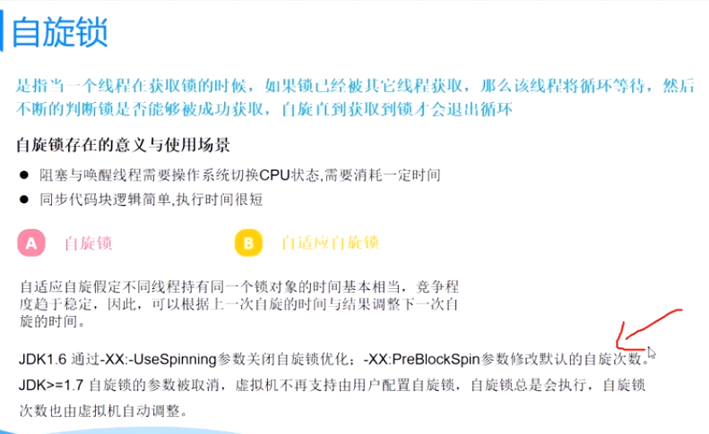

# 自旋机制

    优点: 自旋锁是指尝试获取锁的线程不会立即阻塞,而是采取循环的方式不断尝试获取锁
    这样的优点是减少线程上下文切换的消耗,不会阻塞.
    
    缺点: 不断自旋循环会消耗CPU,它只适用于锁定状态很短的场景.

    在许多场景中，同步资源的锁定时间很短，为了这一小段时间去切换线程可能会让系统得不偿失
    如果当前线程没有拿到锁,我们会让当前线程自旋重新获取锁，如果在自旋后获得了锁，
    那么当前线程就不必阻塞了，从而避免切换线程的开销

# 自旋机制的应用

自旋锁的实现原理同样也是CAS，AtomicInteger中调用unsafe进行自增操作的源码中的do-while循环就是一个自旋操作，如果修改数值失败则通过循环来执行自旋，直至修改成功。

自旋锁在JDK1.4.2中引入，使用-XX:+UseSpinning来开启。JDK 6中变为默认开启，并且引入了自适应的自旋锁（适应性自旋锁）。
 
# 自旋机制存在的问题

    如果某个线程持有锁的时间过长，就会导致CPU空转
    
    如果某个线程没有获得锁就变为阻塞状态的话,就要切换上下文也是消耗性能和时间
    
    所以自旋的次数要合适,来权衡自旋和阻塞

# 自适应性自旋机制

自适应性自旋锁: 会根据我前一次自旋的次数,适当的上下的浮动来调整下一次自旋的次数.

在使用CAS时，如果更新失败，CAS会自旋再次尝试更新。由于自旋是需要消耗 `CPU` 资源的，所以如果长期自旋就白白浪费了 `CPU`。

    在 JDK 1.6 中引入了自适应的自旋锁。自适应意味着自旋的次数不再固定了，而是由前一次在同一个锁上的自旋次数来决定。
    如果某个锁自旋很少成功获得，那么就会减少自旋

自适应意味着自旋的（次数）不再固定，而是由前一次在同一个锁上的自旋时间及锁的拥有者的状态来决定。

如果在同一个锁对象上，自旋等待成功获得过锁，那么jvm就会认为这次自旋也是很有可能再次成功，进而它将允许自旋等待持续相对更长的时间

如果对于某个锁，自旋很少成功获得过，那在以后尝试获取这个锁时将可能省略掉自旋过程，直接阻塞线程，避免浪费处理器资源。
