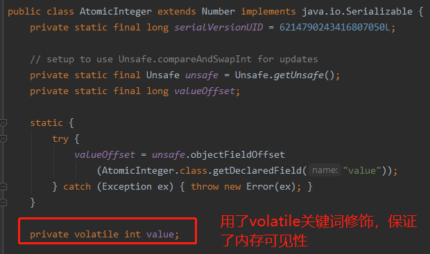
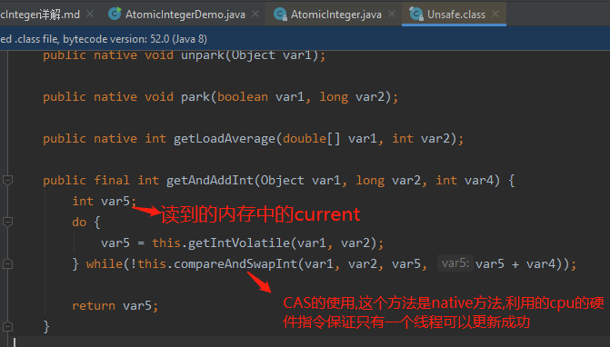

# AtomicInteger为什么是使用CAS实现的,为什么不用synchronized?

    使用synchronized后,能保证数据一致性,同一时间只能有一个线程来访问临界区代码,并发性会下降
    
    cas不加锁,能保证数据一致性,有较高的并发性,但是可能会自旋时间很长,导致给cpu带来很大开销.

# 介绍一下Atomic 原子类

# JUC 包中的原子类是哪4类?

- 使用原子的方式更新基本类型: AtomicInteger(原子整形),AtomicLong,AtomicBoolean
- 数组类型: AtomicIntegerArray,AtomicLongArray,AtomicReferenceArray
- 引用类型原子类: AtomicReference 
- 带时间戳的原子引用类型: AtomicStampedReference,原子更新带有版本号的引用类型,可以解决使用 CAS 进行原子更新时可能出现的 ABA 问题。

# 讲讲 AtomicInteger 的使用

    AtomicInteger 类常用方法
    
    addAndGet: ++i
    getAndAdd: i++
    incrementAndGet: ++i
    getAndIncrement: i++
    get: 获取值
    compareAndSet

# 能不能给我简单介绍一下 AtomicInteger 类的原理

    AtomicInteger这个类用的非常多,所以是面试的重点.

