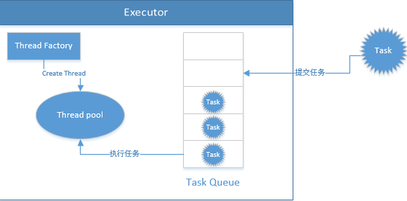

## 为什么引入线程池

在之前的案例中，我们总是通过启动一个新的线程来执行新的任务。对于一些小的应用来说，这是OK的，但是对于一些大型的应用来说，这是不太合适的。例如对于一个高并发的web服务器，如果每一个HTTP请求，我们都使用一个新的线程来处理，那么内存中必然会存在大量的线程，线程的上下文切换以及线程的创建与销毁，都会消耗大量的资源.

因此我们最好将`线程的管理、创建、销毁等操作`与`线程需要执行的任务隔离开来`。具体来说，我们希望有一个类，专门用于管理一批Thread对象，而线程对象的运行时代码(Runnable或者Callable接口的实现类)则另外定义，当需要执行这些任务时，将任务提交给这个类，这个类会安排空闲的线程来运行这个任务。从而避免线程频繁的创建与销毁，以及大量的线程的上下文切换造成的资源损耗.

## executors的含义

>java并发包的设计者也考虑到了上述问题，并将这种起到线程管理作用的类称之为executors。目前executors主要有3个接口:

1. `java.util.concurrent.Executor`是顶级接口，其只定义了一个`void execute(Runnable command)`方法，用于接受可以执行的任务
2. `public interface ExecutorService extends Executor {}`接口在Executor的基础上添加了一些生命周期方法，例如shutdown等.
3. `public interface ScheduledExecutorService extends ExecutorService {}`则进行了一些功能性的扩展，可以在指定的时间、或者周期性的运行某个任务

通常情况下，executors的实现，都包含了一个线程池(thread pool)和一个任务队列(task queue)。我们向executors中提交任务(Runnable或者Callable接口的实现类)，executors会将提交的任务放入任务队列中。然后会从thread pool中选择一个空闲的线程来处理队列中的任务，如果线程池中的所有线程都在处理其他任务，那么等到某个线程处理完自己的任务空闲下来的时候，再将任务队列中的任务交由其处理。下图展示了线程池的工作原理：

从图可以看到，我们提交的任务都会放到executor内部维护的一个任务队列(Task Queue)中，executor会从thread pool中取出线程，来运行执行任务队列中的任务。而thread pool中的线程对象，是通过一个线程工厂(Thread Factory)对象来创建的。使用Thread Factory的原因是因为，通常一个线程池中的所有Thread对象的作用都是相同的，因此我们可能会希望按照某种相同的规则来创建线程，例如给线程池中的所有线程名字都起一个公共的前缀。

事实上，JDK自带的executors的实现，都利用到了我们上述提到的概念：线程工厂(Thread Factory)，线程池(Thread pool)以及任务队列(Task Queue)， 如：ThreadPoolExecutor、ScheduledThreadPoolExecutor、java.util.concurrent.ForkJoinPool。

>其中对于Fork/Join框架是JDK1.7中引入的利用多处理器特性的并发编程框架