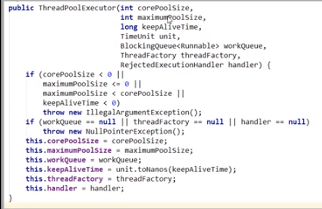
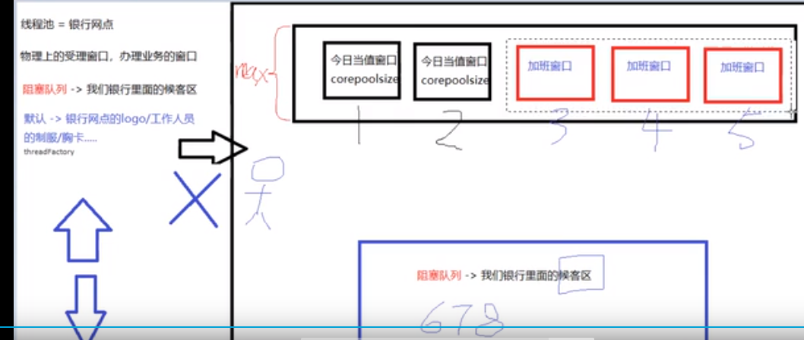

# 线程池的7大参数

    线程池的核心类: ThreadPoolExecutor

# 线程池的7大参数的理解

# 7大参数的动态修改方法

    在大多数情况下7大参数是在初始化ThreadPoolExecutor的时候基于构造函数来设置,当然也可以通过方法动态更改

    setCorePoolSize(int)/getCorePoolSize()
    setMaximumPoolSize(int)/getMaximumPoolSize()
    setKeepAliveTime(long, java.util.concurrent.TimeUnit)
    setRejectedExecutionHandler
    
    getPoolSize()

# 问题

## 当运行线程少于 corePoolSize时,此时有新任务在execute方法中提交,会怎么办,排队还是?

    线程池刚刚创建的时候，是不会初始化所有线程的。只有等到有任务进来的时候，才会创建线程.
    当新任务在execute方法中提交时，如果运行的线程少于corePoolSize，则创建新线程来处理请求，即使其他线程是空闲的

## 如果运行的线程等于或多于corePoolSize，则再向线程池提交任务,会怎么样?
    
    如果运行的线程等于或多于corePoolSize，则始终首选将请求加入队列，而不创建新的线程 

## 线程工厂用哪个?

    创建线程的工厂,一般使用默认的Executors.defaultThreadFactory()即可

## 如何将keepAliveTime的保持活动策略应用到corePoolSize呢?

    1. 默认情况下，保持活动策略只在有多于corePoolSize的线程时应用
    2. 如果 keepAliveTime>0,可以通过allowCoreThreadTimeOut(boolean)方法设置为true,将超时策略应用于核心线程

## 实际生产中,如何配置线程池的最大数量?你是怎么考虑的?

    根据你的业务是cpu密集型还是IO密集型来决定.

    cpu密集: 类似于 while(true)死循环一直占用cpu,大型队列和小型池可以最大限度地降低操作系统上下文切换开销,适用于cpu密集型业务
    io密集: 有很多io操作,比如去数据库的磁道上取数据,如果任务频繁阻塞（I/O操作比较多）,比较适合使用小型队列和较大的池

---

    有时候,创建线程池的核心线程数和最大线程数是一样的，导致一些空闲的线程也得不到回收,这样会有很多无意义的资源消耗。
    所以也可以结合业务将线程池的核心线程数和最大线程数方式调整一下，将线程数降下来,使系统资源更合理的利用.

## 线程池常用任务队列(workQueue)的种类和特点
    
    有界队列有助于防止资源耗尽

    LinkedBlockingQueue默认大小为Integer.MAX_VALUE

    SynchronousQueue队列的特点: 只要一有任务进入队列，就立马要找一个空闲的线程来运行这个任务,
    如果没有线程来执行,就要按照Rejection策略来处理
    它将任务直接提交给线程而不存它们
