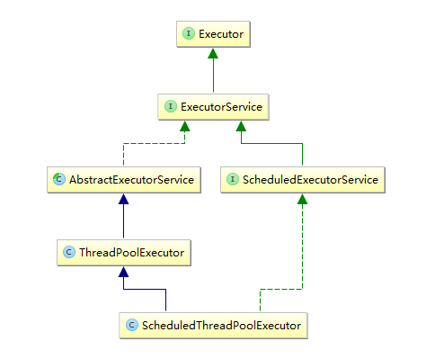

# ScheduledThreadPoolExecutor

    可以周期性执行任务的线程池
    


ScheduledThreadPoolExecutor是ThreadPoolExecutor的子类，同时实现了ScheduledExecutorService接口，它可另行安排在给定的延迟后运行任务(Callable，Runnable)，或者定期执行命令。此类要优于 Timer。

虽然此类继承自ThreadPoolExecutor，但是几个继承的调整方法对此类并无作用。特别是，因为它作为一个使用 corePoolSize 线程和一个无界队列的固定大小的池，所以调整 maximumPoolSize 没有什么效果。

```java
// 可以看到ScheduledThreadPoolExecutor实现了ScheduledExecutorService接口，
// 延迟或者定时执行某个任务的方法，都定义在这个接口中:
public interface ScheduledExecutorService extends ExecutorService {

// 延迟指定时间来执行某个任务
public ScheduledFuture<?> schedule(Runnable command,long delay, TimeUnit unit);

public <V> ScheduledFuture<V> schedule(Callable<V> callable,long delay,TimeUnit unit);
 
// 延迟指定时间后，定时执行某个任务
public ScheduledFuture<?> scheduleAtFixedRate(Runnable command,
    long initialDelay,long period,TimeUnit unit);

//
public ScheduledFuture<?> scheduleWithFixedDelay(Runnable command,
    long initialDelay,long delay,TimeUnit unit);
}

// 注意，这几个方法返回的都是ScheduledFuture接口，其是Future的子接口，其只有一个实现：ScheduledFutureTask，ScheduledFutureTask同时也扩展了FutureTask，(这与我们之前讲解支持异步监听类似，当我们希望Future具备更加强大的能力时，则需要进行相应的扩展)
```

ScheduledThreadPoolExecutor重写了AbstractExecutorService 的 submit 方法，以生成内部ScheduledFutureTask 对象控制每个任务的延迟和调度。这个和我们在上一节的案例中，扩展ThreadPoolExecutor以支持异步监听类似，只不过上一节我们是覆盖newTaskFor方法，回顾newTaskFor就是在submit方法中调用的，相关代码片段如下：

```java
public abstract class AbstractExecutorService implements ExecutorService {
...
public <T> Future<T> submit(Callable<T> task) {
    if (task == null) throw new NullPointerException();
    RunnableFuture<T> ftask = newTaskFor(task);
    execute(ftask);// 构造之后，立即执行(不会延时,所以此方法要覆盖)
    return ftask;
}
protected <T> RunnableFuture<T> newTaskFor(Callable<T> callable) {
    return new FutureTask<T>(callable);
}
}
```

在ScheduledThreadPoolExecutor中之所以选择直接覆盖submit方法而不是newTaskFor方法，因为AbstractExecutorService中调用newTaskFor方法之后就立即执行了(调用execute)，我们这里要实现的是延迟，或者定时执行某个任务，不能立即执行，所以选择覆盖submit方法，进行完全重写。