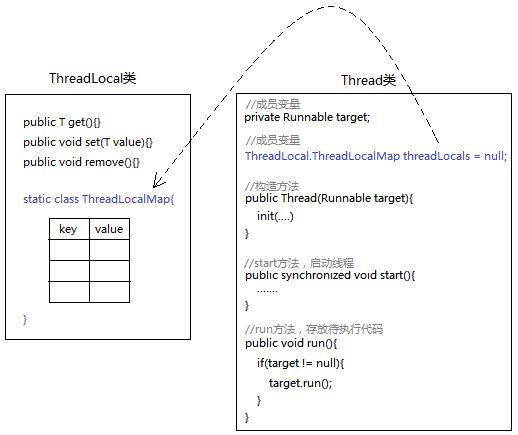
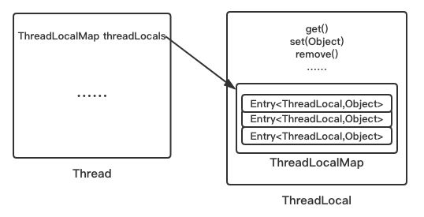
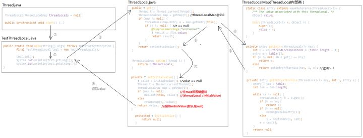

# ThreadLocal

ThreadLocal用于创建线程局部变量,假如有一个对象A,A有一个public的变量var1,所有线程都共享对象A的var1，因此var1不是线程安全的。使用ThreadLocal后,每个线程内部都有自己的var1,且各个线程的修改都互不影响.

>示例: org.java.core.base.multithreading.TheadLocalExample.ThreadLocalExample

# ThreadLocal、ThreadLocalMap、Thread三者关系





## ThreadLocal的set方法图解


>ThreadLocalMap创建的table可以看成一个哈希表，默认大小是16，即有16个槽(slot)。创建table完毕，根据firstKey算出本次插入的槽位，然后用内部类Entry将两个值包装成键值对(entry)，放入槽中：table[i] = new Entry(firstKey, firstValue);

## ThreadLocal的get方法图解




# synchronized和ThreadLocal的区别

>一个方法使用synchronized的话，表示当前有1个线程访问此方法的时候，其他线程都会被阻塞。使用ThreadLocal的话，不存在竞争锁的问题问题.

# ThreadLocal的应用场景

```java
// ThreadLocal应用广泛，下面介绍下在SpringMVC中的应用。

// NamedThreadLocal只是1个带name属性的ThreadLocal
public class NamedThreadLocal<T> extends ThreadLocal<T> {

    private final String name;

    public NamedThreadLocal(String name) {
        Assert.hasText(name, "Name must not be empty");
        this.name = name;
    }

    @Override
    public String toString() {
        return this.name;
    }

}

// SpringMVC中RequestContextHolder内部结构:该类会暴露与线程绑定的RequestAttributes对象
private static final ThreadLocal<RequestAttributes> requestAttributesHolder = new NamedThreadLocal<RequestAttributes>("Request attributes");

// InheritableThreadLocal类是ThreadLocal的子类。为了解决ThreadLocal实例内部每个线程都只能看到自己的私有值，所以InheritableThreadLocal允许一个线程创建的所有子线程访问其父线程的值
private static final ThreadLocal<RequestAttributes> inheritableRequestAttributesHolder =
        new NamedInheritableThreadLocal<RequestAttributes>("Request context");

// 继续看下RequestContextHolder的getRequestAttributes方法，其中接口RequestAttributes是对请求request的封装：
public static RequestAttributes getRequestAttributes() {
    // 直接从ThreadLocalContext拿当前线程的RequestAttributes
    RequestAttributes attributes = requestAttributesHolder.get();
    if (attributes == null) {
        // 获得它父线程中的RequestAttributes值
        attributes = inheritableRequestAttributesHolder.get();
    }
    return attributes;
}

ServletRequestAttributes requestAttributes = (ServletRequestAttributes)RequestContextHolder.getRequestAttributes();
HttpServletRequest request = requestAttributes.getRequest();
```