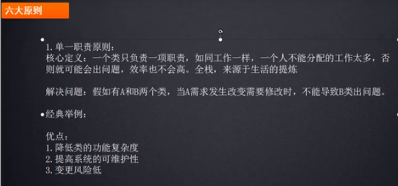

# 设计模式6大核心原则(面向对象6大核心原则)

- 职责单一原则
- 里氏替换原则
- 开闭原则
- 依赖倒置原则(DIP)
- 接口隔离原则
- 迪米特法则(最少知道原则) 

--

    23种设计模式中就使用了这6大核心原则,平时写代码也要尽可能的满足这6大原则.

# 职责单一原则

>做一个类/方法,尽量让这个方法/类职责单一,一个方法,一坨,百十来行代码,改都不敢改.

    方法里面处理的功能职责单一,就不太容易出错.否则方法里面一堆if-else,时间长了,容易出错.
    一个方法里面有几百行代码,从头看到尾, 这样很容易出问题,

    一个方法几百行代码, 要拆分成一个个的子方法, 这是面向对象的非常重要的思想,不要在一个方法中做过多的事情.

# 里氏替换原则(LSP)

    子类可以替换父类,出现在父类的任何地方

    优点: 可以减少bug.避免出现潜在的问题.增强代码的可读性.

# 依赖倒置原则(DIP)

    其实就是面向抽象类/接口编程.

# 接口隔离原则

    功能相关的方法定义到一个接口中,功能不相干的,不要强制定义到一个接口中,不要强制耦合在一起.
    要做接口的拆分,要不然有的实现类都不知道怎么实现你的方法.
    
    在设计接口的时候,要精简单一.

# 开闭原则

    对扩展开放,对修改关闭    

# 迪米特法则(最少知道原则)    

    类与类之间不能有太多的耦合.
    
    高内聚低耦合: 淘宝和顺丰,就是低耦合.没有强依赖关系.