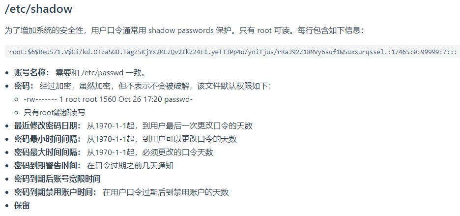
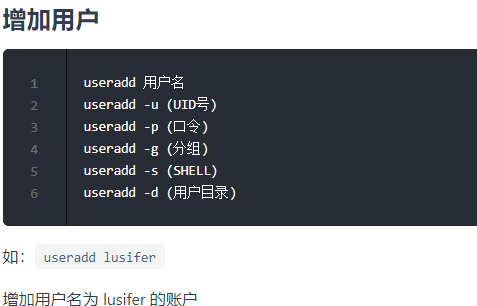
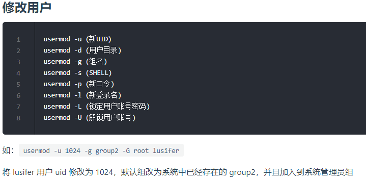

# Linux用户账户说明

一个用户必须隶属于一个组,不然这个用户什么权限都没有,因为权限是赋予组的,一个用户属于这个组,就拥有了这个组的所有权限.当然一个用户可以属于多个组,这样这个 用户就拥有了这些组的所有权限.

当一个用户同时属于多个组中时，在/etc/passwd 文件中记录的是用户所属的主组，也就是登录时所属的默认组

用户的账号可以帮助系统管理员对使用系统的用户进行跟踪，并控制他们对系统资源的访问.





---
    /etc/group 中的每条记录分四个字段：
    
    1. 第一字段：用户组名称
    2. 第二字段：用户组口令，一般不用,一般为空
    3. 第三字段：GID(组标识号)
    4. 第四字段：组内的用户列表.
---






# 实战创建一个新用户

```shell
# 查看新建的用户的权限
id zk

# 将zk添加到root组(或者改为有root权限的组也可以)
usermod -a -G root zk

# 切换到新建用户
su - zk

# 查看当前用户
who i am

# 删除一个用户
userdel zk

# 删除一个组
groupdel groupname
```

# 解决xx is not in the sudoers

```shell script
# xx is not in the sudoers file解决方法
# sudo不是一个组,有sudoer权限的用户/组被定义在一个配置文件中,你可以通过visud访问
# 切换到root用户，运行visudo
visudo
# 找到root ALL=(ALL) ALL，在下面添加一行xxx ALL=(ALL) ALL ,其中xxx是你要加入的用户名称
```

# 授予aa用户sudo权限

```shell script
# 方式1：在sudoers文件中找到有sudo权限的组，添加aa用户到这些组之一，假如你有以下一行在sudoers中:
# Members of the admin group may gain root privileges
%admin ALL=(ALL) ALL 
# 然后使用"usermod -a -G admin aa"添加aa到admin组
usermod -a -G admin aa

# 方式2：创建一个新的bb组，然后把用户aa加到这个组中
# bb组有所有sudo的权限
%bb  ALL=(ALL:ALL) ALL
usermod -a -G bb aa

# 方法3: 为用户aa在sudoers文件中设置一个特殊的rule(注意这里不带%开头，因为%代表的是一个组，不带%表示是一个用户)
aa ALL=(ALL:ALL) ALL 

# 请注意，对于我提到的所有规则，我在任何地方都使用默认的ALL。 第一个ALL是允许的用户，第二个是主机，第三个是运行命令时的用户，最后一个是允许的命令。 如果ALL对于您的用例而言过于宽泛，您可以调整规则。
```
