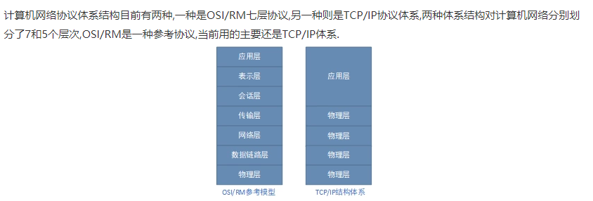
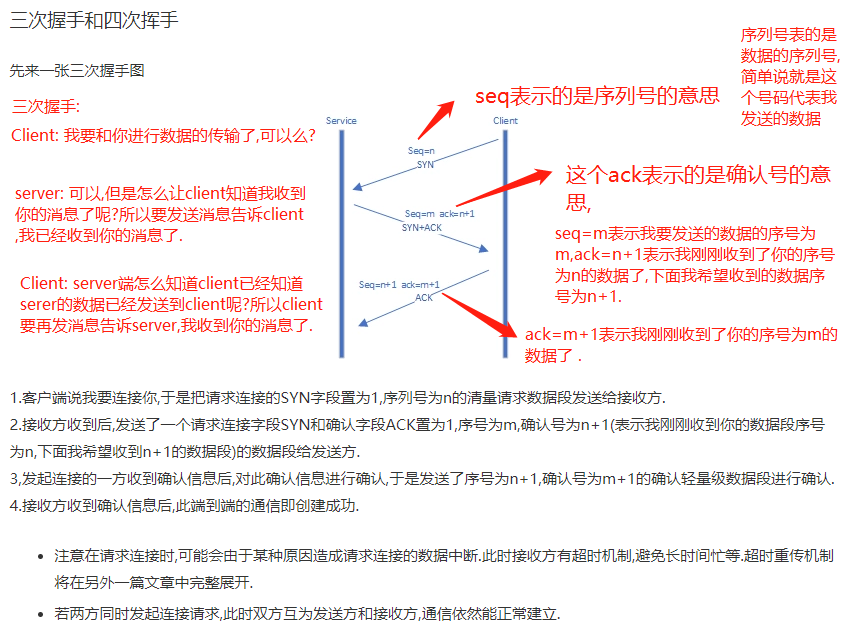
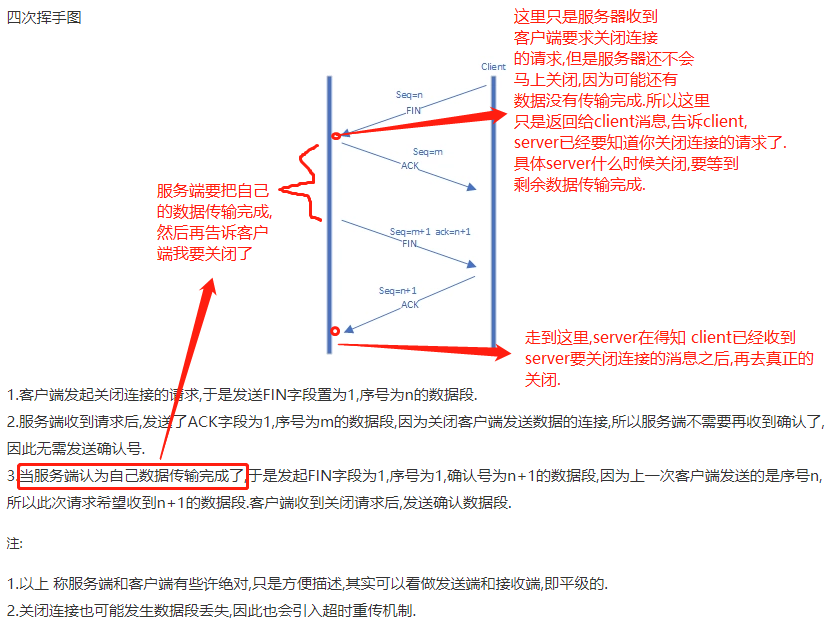

# 三次握手和4次挥手图解






# 三次握手(建立连接)

```
SYN: synchronization(同步)
ACK: acknowledged(得到承认)
RST: reset
```

1. client通过向服务器端每个可能的端口发送一个SYN(synchronization) packet来主动发起连接请求，尝试和服务器的每个可能的端口建立TCP/IP连接, 作为三次握手的一部分。 客户端把这段连接的序号设定为随机数 A(seq=client_isn)。
client  SYN=1，seq=client_isn    ---->          server

2.  如果服务器使用来自特定端口的SYN/ACK(同步确认）数据包进行响应，ACK 的确认码应为 A+1()，SYN/ACK 包本身又有一个随机序号 B。则表示该端口已打开。(If the server responds with a SYN/ACK (synchronization acknowledged) packet from a particular port, it means the port is open.)
client      <----  SYN=1，seq=server_isn,ack=client_isn+1      server

3. 最后，客户端再发送一个ACK。当服务端受到这个ACK的时候，就完成了三路握手，并进入了连接创建状态。此时包序号seq被设定为收到的确认号A+1，而ack则为 B+1。
client  SYN=0，seq=client_isn+1,ack=client_isn+1    ---->          server

## 四次挥手(断开连接)

_注意: 中断连接端可以是client，也可以是server. 下面仅以客户端断开连接举例, 反之亦然._

1. Client端发起中断连接请求，也就是发送FIN标记设置为1,客户端进入 FIN-WAIT 状态.该状态下客户端只接收数据, 不再发送数据.

2. Server端接到FIN=1的数据分段报文后，server会这么理解："Client端没有数据要发给server了"，但是如果server还有数据没有发送完成，则不必急着关闭Socket，可以继续发送数据。所以server发送ACK=1,表示"server告诉Client端，你的FIN请求我收到了，但是我还有数据没有传输完成，请继续等我的数据"。这个时候Client端就进入FIN_WAIT状态

3. client继续等待Server。当Server端确定已经没有数据传输了，则向Client端发送FIN=1数据分段，"告诉Client端，server数据发完了，准备好关闭连接了,并进入 CLOSE-WAIT 状态,等待客户端发来带有ACK=1的确认报文"。

4. Client端收到FIN=1报文后，"就知道可以关闭连接了，但需要通知server说client已经收到FIN=1，以防止服务器重复发送FIN=1，所以client给server发送 ACK=1的报文确认,之后进入后进入TIME_WAIT状态,服务器接收到ACK=1后关闭连接，如果Server端没有收到ACK=1，会重传

5. 客户端等待2MSL后未收到回复, 则认为服务器成功关闭, 客户端就关闭连接.

为什么TIME_WAIT状态需要经过2MSL(最大报文段生存时间)才能返回到CLOSE状态？

答：按道理，四个报文都发送完毕，可以直接进入CLOSE状态了，但是我们必须假象网络是不可靠的，有可能最后一个ACK丢失。所以TIME_WAIT状态就是用来在Server最后没有收到ACK=1的时候，重发FIN=1，直到收到client发送的ACK=1。
