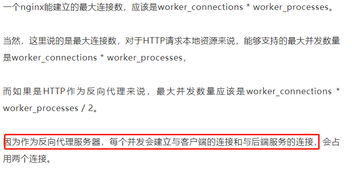
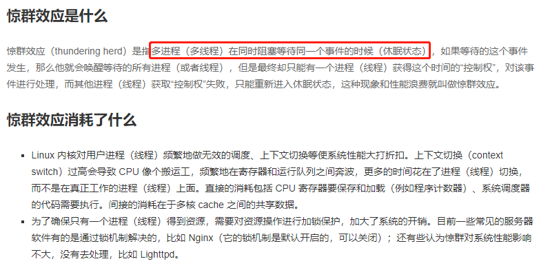
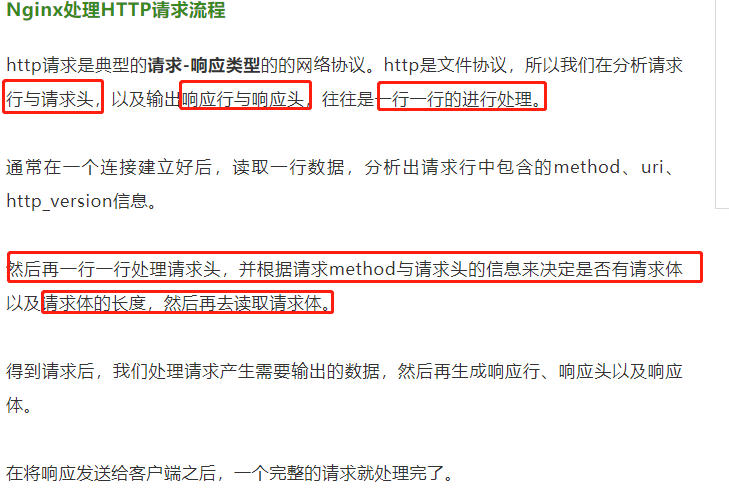

# 什么是 Nginx

Nginx 是一款高性能的“HTTP 服务器”/“反向代理服务器”及“电子邮件（IMAP/POP3）代理服务器”。官方测试 Nginx 能够支支撑 5 万并发链接，并且 CPU、内存等资源消耗却非常低，运行非常稳定。

# Nginx 的应用场景

- HTTP服务器： 可以做静态资源服务器
- 反向代理,负载均衡

# 为什么选择使用nginx

高并发性能的并发模型：性能好、占用内存少、稳定

作为 Web 服务器：相比 Apache，Nginx 使用更少的资源，支持更多的并发连接，体现更高的效率，能够支持高达50000个并发连接数的响应。

# nginx进程模型

Nginx默认采用多进程工作方式，Nginx启动后，会运行一个master进程和多个worker进程。

1. 一个master进程生成多个worker子进程（每个进程只有一个线程），一个worker进程可以响应多个用户请求.
2. 非阻塞、IO复用、事件驱动：select，poll， epoll
3. 占用内存小：10,000个非活动HTTP保持连接占用大约2.5M内存。

## master进程
      
监控worker进程的运行状态,向各worker进程发送信号.

它不需要处理网络事件，不负责业务的执行，只会管理worker进程.

## worker进程

master进程中fork()出多个worker进程.
      
worker主要任务是处理基本的网络事件，完成具体的任务逻辑。多个worker进程之间是对等的，互相独立的。

worker进程主要关注点是与客户端或后端服务器（此时nginx作为中间代理）之间的数据可读/可写等I/O交互事件.

>worker进程个数：

- 如果负载以CPU密集型应用为主，一般会设置与机器cpu核数一致或少一个（少的一个核用来处理用户等其他任务）；
- 如果负载以IO密集型为主，如响应大量内容给客户端，则worker数应该为CPU个数的1.5或2倍。  

因为更多的worker数，只会导致进程来竞争cpu资源了，从而带来不必要的上下文切换。而且，nginx为了更好的利用多核特性，具有cpu绑定选项，我们可以将某一个进程绑定在某一个核上，这样就不会因为进程的切换带来cache的失效。

# 并发处理

1. 在master进程里面，先创建socket，并绑定监听80端口（所以master进程需要root权限）；
2. 然后再fork出多个worker进程，这样每个worker进程都可以去accept这个socket， 或者使用锁机制，让抢到锁的一个worker进程去accept这个socket.
3. 当一个新连接进来后，而只有抢到锁的一个进程可以accept这个连接进行处理（也是放入epoll中）；
4. 抢到锁的worker进程accept到新连接后，会立即释放锁；然后所有worker进程再次参与抢锁，这样就回到了第二步，进行循环处理并发连接；

# 参考

[参考](https://blog.csdn.net/tjiyu/article/details/53027619)