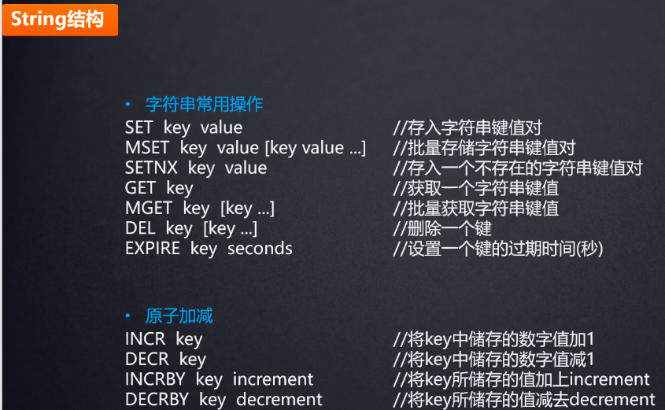
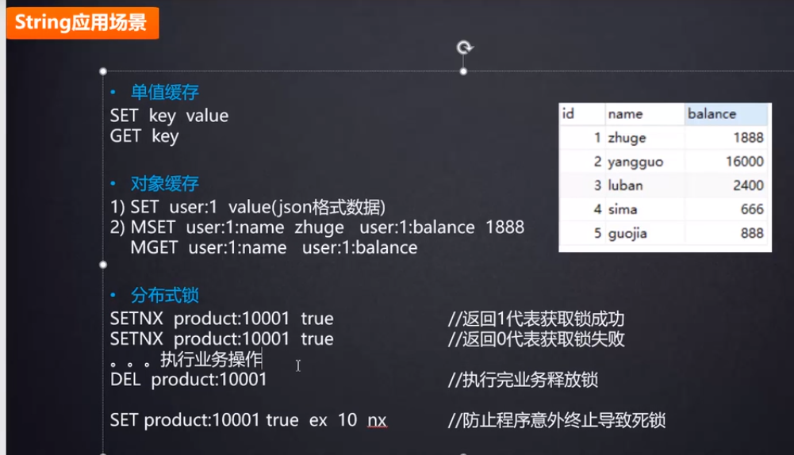
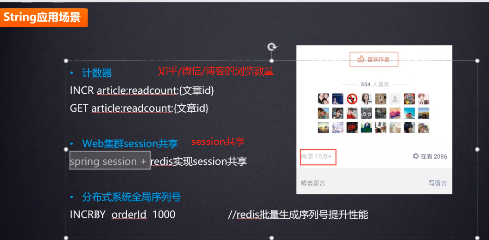
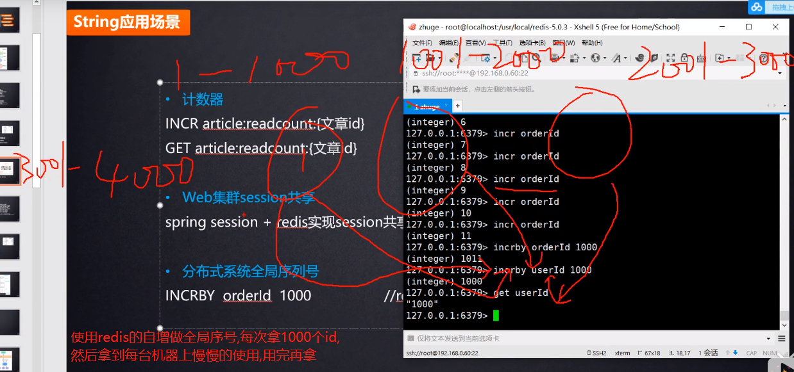

# 字符串类型(Redis中最基本的数据类型)

字符串类型:它能存储任何形式的字符串，包括二进制数据。一个字符串类型的键允许存储的值的最大容量是512MB。

`字符串类型是其他4种数据类型的基础`,例如，列表类型是以列表的形式组织字符串，而集合类型是以集合的形式组织字符串.

# string的使用场景



```shell script
mset user:userId:name zhuge user:userId:balance 1888
mget user:userId:name user:userId:balance
```



```shell script
# Redis是单线程模型(命令在服务器端是串行执行的)
# redis命令是Redis最小执行单位,所以下面命令使用redis的话
# 不用考虑并发,不用考虑加锁.
# 如果是使用mysql数据库存储的话,就要考虑并发和加锁了,效率会低很多.
incr article:readcount:{文章id}

# 在直播系统中，直播间在线总人数
# 每上线一个人,就增加1(直播间id是唯一的)
incr live:{直播间id}:count
# 每下线一个人,就减1
decr live:{直播间id}:count
```



```shell script
# 分布式系统全局序号: 不建议使用uuid(之前mysql讲过为什么不要使用uuid)
# 雪花算法是一线互联网公司使用比较多的场景,这里我们讨论用redis如何实现:

# redis每秒能生成多少订单号?也就是redis单台机器每秒支持的并发数
# 比如单台redis每秒支持1万并发,也就是每秒生成1万个id
# (redis单机的tps是可能也就几万,10万是比较难的,达不到10万,一般也就是几万的并发)
# 我们可以这么做:每次拿1000个,然后拿到本地慢慢用.
# 也就是redis批量生成序号,提升性能
incrby  orderId 1000 
```



# 常用命令

```shell
# 赋值与取值(当键不存在时会返回空结果nil)
SET key value
GET key

# 递增数字(当存储的字符串是整数形式时)
SET num 23
TYPE num
GET num
# 当要操作的键不存在时,默认键值为0，所以递增后是1
INCR num

# 增加指定的整数
INCRBY num 5

# 减少整数
DECR num

# 减少指定的整数
DECRBY num 2

# 增加指定浮点数
INCRBYFLOAT num 2.5

# 向尾部追加值,如果键不存在则将该键的值设置为value,返回值是追加后字符串的总长度
APPEND num 7, 

# 如果参数包含空格，在redis-cli中输入需要双引号以示区分
set spacevalue "xzj xzj"

# 获取字符串长度,如果键不存在则返回0
STRLEN num

# 字符串类型可以存储任何编码的字符串
# 如果使用UTF-8编码，由于“你”和“好”两个字的UTF-8编码的长度都是3
# 如果是其他编码就不一定了
set chinese 你好
strlen chinese

# 同时获得/设置多个键值(批处理)
MGET num num2
MSET num1 value1 num2 value2

GETRANGE key start end
SET mykey "This is a string"
getrange mykey 0 3
getrange mykey -3 -1
getrange mykey 0 -1

SETRANGE key1 6 "Redis"
```

## Redis键名的命名规则

>Redis对于键(key)的命名没有强制的要求，比较好的实践是用“对象类型:对象ID:对象属性”来命名一个键，如user:1:friends来存储ID为1的user的好友列表。对于对象属性是多个单词则推荐使用“.”分隔,另外键的命名可读性要好.

1. 文章访问量统计:可以为每篇文章用名为`post:文章ID:page.view`的键来记录文章的访问量，每次访问用INCR使键`post:文章ID:page.view`对应的值递增。

2. 怎么为每篇文章生成一个唯一ID呢？对于每一类使用: `对象类型的复数形式:count`的键（如users:count）来存储当前类型对象的数量，每增加一个新对象时都使用INCR命令递增该键的值。由于使用INCR命令建立的键的初始键值是1，所以INCR命令的返回值既是加入该对象后的当前类型的对象总数，又是该新增对象的ID。`注意：这个键名只是参考命名，实际使用中可以使用任何容易理解的名称。`

3. 存储文章数据:每个字符串类型只能存储一个字符串，而一篇博客文章是由标题、正文、作者与发布时间等多个元素构成的。为了存储这些元素，我们需要使用序列化函数将它们转换成一个字符串.

## 位操作

>一个字节由8位组成,`SET foo bar`，bar的3个字母对应的ASCII码分别为98、97和114，转换成二进制后分别为1100010、1100001和1110010.

```shell
# 获得指定位置的二进制位的值(0或1),索引从0开始(注意index从右边开始,也就是低位),如果需要获取的二进制位的索引超出了键值的二进制位的实际长度则默认位值是0.
GETBIT foo 0

# 设置指定位置的二进制位的值(返回值是该位置的旧值)
SETBIT foo 6 0

# 设置的位置超过了键值的二进制位的长度，SETBIT命令会自动将中间的二进制位设置为0
SETBIT foo 257 1

# "设置不存在键"的指定二进制位的值会自动将其前面的位赋值为0
SETBIT nofoo 10 1
GETBIT nofoo 5

# 获得字符串类型键中值是1的二进制位个数
BITCOUNT foo

# 通过参数来限制统计的字节范围，如我们只希望统计前两个字节
BITCOUNT foo 0 1

# 对多个字符串类型键进行位运算，并将结果存储在destkey参数指定的键中
SET foo1 bar
SET foo2 aar

# BITOP命令支持的运算操作有AND、OR、XOR和NOT
BITOP OR res foo1 foo2

# 得到"car"
GET res
```

>利用位操作命令可以非常紧凑地存储布尔值。比如某网站的每个用户都有一个递增的整数ID，如果使用一个字符串类型键配合位操作来记录每个用户的性别（用户ID作为索引，二进制位值1和0表示男性和女性），那么记录100万个用户的性别只需占用100 KB多的空间，而且由于GETBIT和SETBIT的时间复杂度都是0(1)，所以读取二进制位值性能很高。
