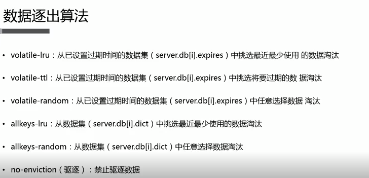

# 生存时间

# 使用场景

在实际的开发中经常会遇到一些有时效的数据，比如限时优惠活动、缓存或验证码等，过了一定的时间就需要删除这些数据。在关系数据库中一般需要额外的一个字段记录到期时间，然后定期检测删除过期数据。而在Redis中可以使用EXPIRE命令设置一个键的生存时间，到时间后Redis会自动删除它。

## 常用命令

>EXPIRE命令使用方法: `EXPIRE key seconds`，其中seconds参数表示键的生存时间，单位是秒

```shell
# 如要想session:29e3d键在15分钟后被删除
SET session:29e3d uid1314

# EXPIRE命令返回1表示设置成功，返回0则表示键不存在或设置失败
EXPIRE session:29e3d 900

# 也可以创建key 的时候设置
set session:29e3d uid1314 EX 900

# 要知道一个键还有多久的时间会被删除，可以使用TTL命令。返回值是键的剩余时间（单位是秒）
TTL session:29e3d

# 可见随着时间的不同，foo键的生存时间逐渐减少，20秒后foo键会被删除。当键不存在时TTL命令会返回-1
TTL session:29e3d

# 另外同样会返回-1的情况是没有为键设置生存时间（即永久存在，这是建立一个键后的默认情况）

# 取消键的生存时间设置（即将键恢复成永久的），可以使用PERSIST命令。
# 如果生存时间被成功清除则返回1；否则返回0（因为键不存在或键本来就是永久的）
PERSIST foo

# 除了PERSIST命令之外，使用SET命令为键赋值也会同时清除键的生存时间
SET foo bar

# 使用EXPIRE命令会重新设置键的生存时间
SET foo bar
EXPIRE foo 20
TTL foo

EXPIRE foo 20
TTL foo

# EXPIRE命令的seconds参数必须是整数，所以最小单位是1秒。
# 如果想要更精确的控制键的生存时间应该使用PEXPIRE命令，PEXPIRE命令与EXPIRE的唯一区别是前者的时间单位是毫秒，

# PTTL命令以毫秒为单位返回键的剩余时间

# 两个相对不太常用的命令：EXPIREAT 和PEXPIREAT
# EXPIREAT命令与EXPIRE命令的差别在于前者使用Unix时间作为第二个参数表示键的生存时间的截止时间
# PEXPIREAT命令与EXPIREAT命令的区别是前者的时间单位是毫秒
SET foo bar
EXPIREAT foo 1351858600
TTL foo
PEXPIREAT foo 1351858700000
```

>其他只对键值进行操作的命令（如INCR、LPUSH、HSET、ZREM）均不会影响键的生存时间.

>提示:如果使用WATCH命令监测了一个拥有生存时间的键，该键时间到期自动删除并不会被WATCH命令认为该键被改变。

### 实现缓存

>为了提高网站的负载能力，常常需要将一些`访问频率较高但是对CPU或IO资源消耗较大的操作的结果缓存起来，并希望让这些缓存过一段时间自动过期`

#### 缓存使用场景举例

>比如教务网站要对全校所有学生的各个科目的成绩汇总排名，并在首页上显示前10名的学生姓名，由于计算过程较耗资源，所以可以将结果使用一个Redis的字符串键缓存起来。由于学生成绩总在不断地变化，需要每隔两个小时就重新计算一次排名，这可以通过给键设置生存时间的方式实现。每次用户访问首页时程序先查询缓存键是否存在，如果存在则直接使用缓存的值；否则重新计算排名并将计算结果赋值给该键并同时设置该键的生存时间为两个小时.

```shell
# 伪代码如下:

rank=GET cache:rank
if not rank
rank=计算排名...
MUlTI
SET cache:rank, rank
EXPIRE cache:rank, 7200
EXEC
```

# MySQL里有2000w数据，Redis中只存20w的数据，如何保证Redis中的数据都是热点数据（redis有哪些数据淘汰策略？？？）

#### Redis键生存时间过短和多长导致的问题?

>然而在一些场合中这种方法并不能满足需要。当服务器内存有限时，`如果大量地使用缓存键且生存时间设置得过长就会导致Redis占满内存`；另一方面如果为了防止Redis占用内存过大而将缓存键的生存时间设得太短，就可能导致缓存命中率过低并且大量内存白白地闲置。

#### 设置Redis能够使用的最大内存

实际开发中会发现很难为缓存键设置合理的生存时间，为此可以限制Redis能够使用的最大内存，并让Redis按照一定的规则淘汰不需要的缓存键，`这种方式在只将Redis用作缓存系统时非常实用。`

>具体的设置方法为：修改配置文件的`maxmemory`参数，限制Redis最大可用内存大小（单位是字节），当超出了这个限制时Redis会依据`maxmemory-policy参数指定的策略来删除不需要的键`，直到Redis占用的内存小于指定内存。

maxmemory-policy支持的规则如下所示。其中的LRU（Least Recently Used）算法即“最近最少使用”，其认为最近最少使用的键在未来一段时间内也不会被用到，即当需要空间时这些键是可以被删除的:

<table>
<thead>
    <tr>
       <th>规则</th>
       <th>说明</th>
    </tr>
</thead>
<tbody>
    <tr>
       <td>volatile-lru</td>
       <td>使用LRU算法删除一个键(只对设置了生存时间的键)</td>
    </tr>
    <tr>
       <td>allkeys-lru</td>
       <td>使用LRU算法删除一个键</td>
    </tr>
    <tr>
       <td>volatile-random</td>
       <td>随机删除一个键(只对设置了生存时间的键)</td>
    </tr>
    <tr>
       <td>allkeys-random</td>
       <td>随机删除一个键</td>
    </tr>
    <tr>
       <td>volatile-ttl</td>
       <td>删除生存时间最近的一个键</td>
    </tr>
    <tr>
       <td>noeviction</td>
       <td>不删除键，只返回错误,在内存满的时候,不能淘汰数据,只返回错误,这个时候需要我们扩容或者删除数据</td>
    </tr>
</tbody>
</table>

>是两两组合

volatile(易变的)指的是从已经设置过期时间的key里面挑选 最近最少使用(lru)的数据进行淘汰.

ttl: 指的是快要过期的数据进行淘汰

random: 任意选取数据(随机算法).

allkeys: 所有的key, allkeys-lru:所有的key根据lru算法进行淘汰.



>如当maxmemory-policy设置为allkeys-lru时，一旦Redis占用的内存超过了限制值，Redis会不断地删除数据库中最近最少使用的键① ，直到占用的内存小于限制值。

    注释：①事实上Redis并不会准确地将整个数据库中最久未被使用的键删除，而是每次从数据库中随机取3个键并删除这3个键中最久未被使用的键。删除生存时间最接近的键的实现方法也是这样。“3”这个数字可以通过Redis的配置文件中的maxmemory-samples参数设置


db就是类似于关系型数据的里面的一个数据,一个redis实例是从0-15号,一共16个db.

## 实现Redis分布式锁

对于某个原本带有生存时间（TTL）的键来说， 当 SET 命令成功在这个键上执行时， 这个键原有的TTL将被清除

>从 Redis 2.6.12 版本开始， SET 命令的行为可以通过一系列参数来修改：

- EX second ：设置键的过期时间为 second 秒。 SET key value EX second 效果等同于 SETEX key second value 。
- PX millisecond ：设置键的过期时间为 millisecond 毫秒。 SET key value PX millisecond 效果等同于 PSETEX key millisecond value 。
- NX ：只在键不存在时，才对键进行设置操作。 SET key value NX 效果等同于 SETNX key value 。
- XX ：只在键已经存在时，才对键进行设置操作。

>因为 SET 命令可以通过参数来实现和 SETNX 、 SETEX 和 PSETEX 三个命令的效果，所以将来的 Redis 版本可能会废弃并最终移除 SETNX 、 SETEX 和 PSETEX 这三个命令。

返回值：

1. 在 Redis 2.6.12 版本以前， SET 命令总是返回 OK 。
2. 从 Redis 2.6.12 版本开始， SET 在设置操作成功完成时，才返回 OK 。如果设置了 NX 或者 XX ，但因为条件没达到而造成设置操作未执行，那么命令返回空批量回复（NULL Bulk Reply）。

### 示例

```shell
# 对不存在的键进行设置
SET key "value"
GET key

# 对已存在的键进行设置
SET key "new-value"
GET key

# 使用 EX 选项
SET key-with-expire-time "hello" EX 10086
GET key-with-expire-time
TTL key-with-expire-time

# 使用 PX 选项
SET key-with-pexpire-time "moto" PX 123321
GET key-with-pexpire-time
PTTL key-with-pexpire-time

# 使用 NX 选项
# 键不存在，设置成功
SET not-exists-key "value" NX
GET not-exists-key

# 键已经存在，设置失败
SET not-exists-key "new-value" NX
# 维持原值不变
GEt not-exists-key

# 使用 XX 选项
EXISTS exists-key
(integer) 0

redis 127.0.0.1:6379> SET exists-key "value" XX
(nil)   # 因为键不存在，设置失败

redis 127.0.0.1:6379> SET exists-key "value"
OK      # 先给键设置一个值

redis 127.0.0.1:6379> SET exists-key "new-value" XX
OK      # 设置新值成功

redis 127.0.0.1:6379> GET exists-key
"new-value"

# NX 或 XX 可以和 EX 或者 PX 组合使用

redis 127.0.0.1:6379> SET key-with-expire-and-NX "hello" EX 10086 NX
OK

redis 127.0.0.1:6379> GET key-with-expire-and-NX
"hello"

redis 127.0.0.1:6379> TTL key-with-expire-and-NX
(integer) 10063

redis 127.0.0.1:6379> SET key-with-pexpire-and-XX "old value"
OK

redis 127.0.0.1:6379> SET key-with-pexpire-and-XX "new value" PX 123321
OK

redis 127.0.0.1:6379> GET key-with-pexpire-and-XX
"new value"

redis 127.0.0.1:6379> PTTL key-with-pexpire-and-XX
(integer) 112999
```

## 使用模式

>命令 SET resource-name anystring NX EX max-lock-time 是一种在 Redis 中实现锁的简单方法。

客户端执行以上的命令：

1. 如果服务器返回 OK ，那么这个客户端获得锁。
2. 如果服务器返回 NIL ，那么客户端获取锁失败，可以在稍后再重试。

设置的过期时间到达之后，锁将自动释放。

可以通过以下修改，让这个锁实现更健壮：

- 不使用固定的字符串作为键的值，而是设置一个不可猜测（non-guessable）的长随机字符串，作为口令串（token）。
- 不使用 DEL 命令来释放锁，而是发送一个 Lua 脚本，这个脚本只在客户端传入的值和键的口令串相匹配时，才对键进行删除。

>这两个改动可以防止持有过期锁的客户端误删现有锁的情况出现。

以下是一个简单的解锁脚本示例：

```lua
if redis.call("get",KEYS[1]) == ARGV[1]
then
    return redis.call("del",KEYS[1])
else
    return 0
end
```

>这个脚本可以通过 EVAL ...script... 1 resource-name token-value 命令来调用。